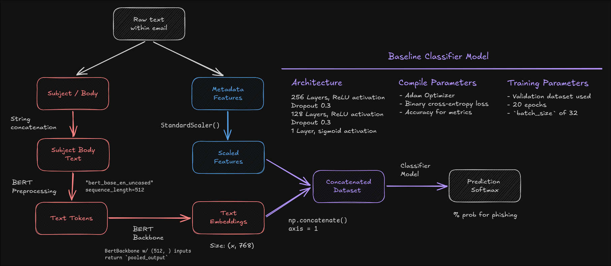

# BERT Preprocessing + Classifier Model Hybrid for Phishing Detection 

This is a phishing detection hybrid neural network model using BERT for tokenization 
and embedding of text (feature extraction), with a multi-layer classifier used for 
predicting phishing emails with embeddings and metadata features in a combined dataset.

## Project Information

This project uses the **GPU release** of `tensorflow==2.20.x`,
as running the BERT preprocessors can **take hours** on the CPU.

If needed, [embeddings](/embeddings) have been provided if you don't want to spend time on the compute 
or lack a GPU to run the preprocessors.

This project has an [IMAP-based web email client](https://github.com/ProximaPrism/phishing-detection-demo) to show how the model can be used. 

## Running the Project

It is highly recommended you run a seperate virtual environment (`.venv`) with **Python 3.12.x** within the project.

This is because the BERT preprocessors used from `keras_hub` require the `tensorflow-text` library,
which the latest version (as of Jul '26) only works with `tensorflow==2.20.x`

## Model Architecture

### Processing

Within a given email, metadata features (such as sender and date) and text features (subject and body) 
are processed differently after being split into training, validation and test datasets.

For textual data (subject + body),
- Initialize the model, disable its training to ensure it's only for feature extraction
- The body and subject are paired together for BERT to prcoess
- Text is tokenized and embedded, returning a 768-dimension vector to represent the email as a whole

For metadata features,
- Feature engineering is done to convert all the features into numeric representations
- Perform cyclic encoding on time-based features so that the nature of these features are captured
- Scale all the features using `StandardScaler`

After the features have been processed, we combine them into a single dataset to be used in the classifier.

This finalized dataset is a 780-dimension vector (768 text + 12 numeric)

The classifier model used is a multi-layer neural network with:
- 256-d layer with `ReLU` activation
- 0.3 dropout, disabling 30% of neurons at random in the model
- 128-d layer with `ReLU` activation
- 0.3 dropout
- 1-d layer with `sigmoid` activation, returns probability output for phishing

The classifier was compiled with:
- Adam optimizer
- Binary cross-entropy loss
- Accuracy for metrics

The classifier was trained using:
- Validation data (10% of dataset)
- `batch_size` of 32
- Running for 20 epochs

### Choice of BERT and Multi-layer Neural Network Classifier
#### BERT

BERT was chosen because understanding meaning and context of the emails is important in 
detecting whether a given email is phishing or normal. 

Unlike "bag-of-words", BERT doesn't treat words within the text independently and can recognize how certain words
can change the meaning or context in text. This is useful in phishing detection because these malicious emails often 
attempt to imitate normal language used in emails.

Additionally, BERT is able to capture meaning within the emails despite the different words used in them,
which helps the neural network classifier to generalize phishing emails and normal emails without such emails
requiring specific words.

In the initialization process, the BERT backbone was frozen (disabled for training). This ensures that BERT
is only used as a feature extractor, and that the classifier is the only model learning from the dataset.

#### Classifier

The neural network was designed for finding relations between the text embeddings and the 
email metadata. 

Hence, the network is designed with decreasing neurons with each layer so that the classifier will have to combine 
the embeddings and metadata. This allows the model to generalize well, as this encourages the classifier to learn
to represent the relationship between these features more compactly, and thus drop redundant features.

Dropouts were used to reduce the high-dimensionality of the BERT embeddings, encouraging the model to not rely 
heavily on a single feature for its classification of a phishing email. This similarly improves generalization.

### Diagram

## References

### Training Data

**AVN Phishing Email Classification Dataset**\
From AVN Bluefox (Amritha V Nair) - 2025. Under CC BY 4.0 License\
https://www.kaggle.com/datasets/avnbluefox/avn-phishing-email-classification-dataset?select=AVN_Corpus.csv